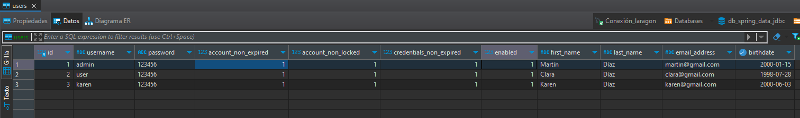

# [Spring Data JDBC](https://www.youtube.com/playlist?list=PLbuI9mmWSoUFGL6B_NxB9IoGqyDq-vEen)

Tomado del canal de youtube **Spring Boot TUTORIAL**

---

## [Qué es Spring Data JDBC](https://spring.io/projects/spring-data-jdbc)

Spring Data JDBC, parte de la familia más grande Spring Data, `facilita la implementación de repositorios basados en
JDBC`. Este módulo trata sobre el soporte mejorado para las capas de acceso a datos basadas en JDBC. Facilita la
creación de aplicaciones impulsadas por Spring que utilizan tecnologías de acceso a datos.

Spring Data JDBC pretende ser conceptualmente fácil. Para lograr esto, `NO ofrece almacenamiento en caché, lazy loading,
escritura detrás o muchas otras características de JPA`. Esto hace que Spring Data JDBC sea un ORM simple, limitado y
obstinado.

> Fuente: [**Baeldung**](https://www.baeldung.com/spring-data-jdbc-intro)
>
> **Spring Data JDBC** es un marco de persistencia que no es tan complejo como Spring Data JPA. **No proporciona caché,
> carga diferida, escritura posterior ni muchas otras características de JPA**. Sin embargo, tiene su propio ORM y
> **proporciona la mayoría de las funciones que usamos con Spring Data JPA, como entidades mapeadas, repositorios,
> anotaciones de consultas y JdbcTemplate.**
>
> Una cosa importante a tener en cuenta es que Spring Data JDBC no ofrece generación de esquemas. Como resultado,
> **somos responsables de crear explícitamente el esquema.**

### El Aggregate Root

Los repositorios de Spring Data están inspirados en el repositorio como se describe en el libro Domain Driven Design de
Eric Evans. Una consecuencia de esto es que `debe tener un repositorio por Aggregate Root`. El **Aggregate Root** es
otro concepto del mismo libro y **describe una entidad que controla el ciclo de vida de otras entidades que juntas son
un Agregado**. `Un Aggregate` es un subconjunto de su modelo que es consistente entre las llamadas de método a su
Aggregate Root.

### Características de Spring Data JDBC

- Operaciones CRUD para agregados simples con NamingStrategy personalizable.
- Soporte para anotaciones @Query.
- Soporte para consultas MyBatis.
- Eventos.
- Configuración de repositorio basada en JavaConfig introduciendo @EnableJdbcRepositories.

## Dependencias del proyecto

Iniciamos el proyecto con las siguientes dependencias:

````xml
<!--Versión de Spring Boot: 3.1.2-->
<!--Versión de Java: 17-->
<dependencies>
    <dependency>
        <groupId>org.springframework.boot</groupId>
        <artifactId>spring-boot-starter-data-jdbc</artifactId>
    </dependency>
    <dependency>
        <groupId>org.springframework.boot</groupId>
        <artifactId>spring-boot-starter-web</artifactId>
    </dependency>

    <dependency>
        <groupId>com.mysql</groupId>
        <artifactId>mysql-connector-j</artifactId>
        <scope>runtime</scope>
    </dependency>
    <dependency>
        <groupId>org.projectlombok</groupId>
        <artifactId>lombok</artifactId>
        <optional>true</optional>
    </dependency>
    <dependency>
        <groupId>org.springframework.boot</groupId>
        <artifactId>spring-boot-starter-test</artifactId>
        <scope>test</scope>
    </dependency>
</dependencies>
````

## Configuración de acceso a datos con Spring Data JDBC

Primero necesitamos realizar algunas configuraciones en el **application.properties**:

````properties
# DataSource
spring.datasource.url=jdbc:mysql://localhost:3306/db_spring_data_jdbc?serverTimezone=America/Lima
spring.datasource.username=root
spring.datasource.password=magadiflo
spring.datasource.driver-class-name=com.mysql.cj.jdbc.Driver
# Initialize a Database Using Basic SQL Scripts: schema.sql y data.sql
spring.sql.init.mode=always
# Logging JdbcTemplate Queries
logging.level.org.springframework.jdbc.core.JdbcTemplate=DEBUG
logging.level.org.springframework.jdbc.core.StatementCreatorUtils=TRACE
````

A continuación explico los **tres apartados que definí en el application.properties:**

### (1) DataSource

Corresponde a las configuraciones que siempre hemos realizado para definir la base de datos con el que trabajaremos, en
este caso, definimos la url de MySql, su username, password y su dirver class name.

### (2) Initialize a Database Using Basic SQL Scripts: schema.sql y data.sql

[Fuente: Spring Boot](https://docs.spring.io/spring-boot/docs/current/reference/html/howto.html#howto.data-initialization.using-basic-sql-scripts)  
Para cualquier inicialización basada en scripts, es decir, insertar datos a través de `data.sql` o crear un esquema a
través de un `schema.sql`, debemos establecer la propiedad `spring.sql.init.mode=always`. **Para bases de datos
embebidas como H2, esto se establece en siempre de forma predeterminada.**

### (3) Logging JdbcTemplate Queries

[Fuente: Spring Data JDBC](https://docs.spring.io/spring-data/jdbc/docs/current/reference/html/#jdbc.logging)  
**Spring Data JDBC realiza poco o ningún registro (logging) por sí solo**. En cambio, la mecánica de `JdbcTemplate`
proporciona registro (logging) para emitir declaraciones SQL. Por lo tanto, **si desea inspeccionar qué declaraciones
SQL se ejecutan, active el registro para NamedParameterJdbcTemplate o MyBatis de Spring.**

`Spring Data JDBC` se basa en la funcionalidad proporcionada por `JdbcTemplate` para interactuar con la base de datos,
pero abstrae aún más la capa de acceso a datos proporcionando un enfoque más orientado a objetos.

Por lo tanto, **como requerimos tener un registro en consola de las sentencias SQL ejecutadas utilizaremos las
configuraciones proporcionadas por JdbcTemplate.**

[Logging JdbcTemplate Queries](https://www.baeldung.com/sql-logging-spring-boot#loggingJdbcTemplate)  
**Para configurar el registro (logging) de instrucciones cuando se usa JdbcTemplate**, necesitamos las siguientes
propiedades:

````properties
logging.level.org.springframework.jdbc.core.JdbcTemplate=DEBUG
logging.level.org.springframework.jdbc.core.StatementCreatorUtils=TRACE
````

Es similar a la configuración de registro (logging) JPA, **la primera línea es para registrar instrucciones** y la
segunda es para registrar parámetros de instrucciones preparadas.

## Creación de los scripts SQL schema.sql y data.sql

Adelantándonos un poco en la creación del proyecto es que crearemos los scripts SQL de la base de datos.

### Script DDL schema.sql

> Lenguaje de Definición de Datos (DDL) se utiliza para definir y gestionar la estructura de la base de datos. Implica
> la creación, modificación y eliminación de objetos en la base de datos, como tablas, índices, vistas y restricciones:
> **CREATE TABLE, ALTER TABLE, DROP TABLE, CREATE INDEX, CREATE VIEW, ETC**.

En nuestro script `schema.sql` definimos la creación de la tabla usuarios con el que trabajaremos inicialmente en este
proyecto:

````sql
DROP TABLE IF EXISTS users;

CREATE TABLE users(
    id INT AUTO_INCREMENT PRIMARY KEY,
    username VARCHAR(50) NOT NULL,
    password VARCHAR(256) NOT NULL,
    account_non_expired BIT,
    account_non_locked BIT,
    credentials_non_expired BIT,
    enabled BIT,
    first_name VARCHAR(50),
    last_name VARCHAR(50),
    email_address VARCHAR(100),
    birthdate DATE
);
````

### Script DML data.sql

> Lenguaje de Manipulación de Datos (DML), se utiliza para interactuar con los datos almacenados en la base de datos.
> Los comandos DML permiten la inserción, actualización y eliminación de registros en las tablas, así como la
> recuperación de datos mediante consultas: **SELECT, INSERT INTO, UPDATE, DELETE FROM**.

En nuestro script `data.sql` definimos los datos que insertaremos en la tabla usuarios:

````sql
INSERT INTO users(username, password, account_non_expired, account_non_locked, credentials_non_expired, enabled, first_name, last_name, email_address, birthdate) VALUES('admin', '123456', true, true, true, true, 'Martín', 'Díaz', 'martin@gmail.com', '2000-01-15');
INSERT INTO users(username, password, account_non_expired, account_non_locked, credentials_non_expired, enabled, first_name, last_name, email_address, birthdate) VALUES('user', '123456', true, true, true, true, 'Clara', 'Díaz', 'clara@gmail.com', '1998-07-28');
INSERT INTO users(username, password, account_non_expired, account_non_locked, credentials_non_expired, enabled, first_name, last_name, email_address, birthdate) VALUES('karen', '123456', true, true, true, true, 'Karen', 'Díaz', 'karen@gmail.com', '2000-06-03');
````

Cuando levantemos el proyecto veremos generado la tabla **users** en nuestra base de datos de MySQL de la siguiente
manera:


Los datos también estarán poblados en la tabla users:



## Creación de entidad, repositorio, servicio y controlador

### Entity User

Iniciaremos con la entidad **User** y a continuación con las demás capas necesarias para su funcionamiento:

````java
import lombok.Builder;
import lombok.Data;
import org.springframework.data.annotation.Id;
import org.springframework.data.relational.core.mapping.Column;
import org.springframework.data.relational.core.mapping.Table;

import java.time.LocalDate;

@Data
@Builder
@Table(name = "users")
public class User {
    @Id
    private Integer id;
    private String username;
    private String password;
    @Column(value = "account_non_expired")
    private Boolean accountNonExpired;
    private Boolean accountNonLocked;
    private Boolean credentialsNonExpired;
    private Boolean enabled;
    private String firstName;
    private String lastName;
    private String emailAddress;
    private LocalDate birthdate;
}
````

Como observamos en el código anterior, la definición de la entidad es similar a la que trabajamos con JPA, pero en este
código no existe la anotación **@Entity** tampoco **@GeneratedValue**, etc. pero mantenemos otras anotaciones que no
son de JPA sino del propio spring.

> Notar que estoy utilizando **lombok** para hacer el código más limpio y enfocarnos en la forma en la que trabaja
> Spring Data Jdbc.

### Repository IUserRepository

Crearemos ahora el repositorio `IUserRepository` asociado al entity User:

````java
import com.magadiflo.spring.data.jdbc.app.entities.User;
import org.springframework.data.repository.ListCrudRepository;
import org.springframework.data.repository.ListPagingAndSortingRepository;

public interface IUserRepository extends ListCrudRepository<User, Integer>,
        ListPagingAndSortingRepository<User, Integer> {
}
````

`ListCrudRepository<,>`, interfaz para operaciones CRUD genéricas en un repositorio para un tipo específico. **Esta es
una extensión de la Lista de retorno de CrudRepository en lugar de Iterable** cuando corresponda.

`ListPagingAndSortingRepository<,>`, fragmento del repositorio para proporcionar métodos para **recuperar entidades
utilizando la abstracción de paginación y clasificación**. Esta es una **extensión de PagingAndSortingRepository que
devuelve List en lugar de Iterable cuando corresponda.**

**NOTA**

> Al igual que sucedía cuando trabajábamos con Spring Data JPA, aquí tampoco necesitamos utilizar el estereotipo
> `@Repository` en la interfaz `IUserRepository`, porque estamos extendiendo de una interfaz de Spring quien, pues hará
> la implementación del repositorio en tiempo de ejecución y creará un @Bean registrándolo en el contenedor de Spring.

### Service UserService

Crearemos ahora la clase de servicio:

````java
import com.magadiflo.spring.data.jdbc.app.entities.User;
import com.magadiflo.spring.data.jdbc.app.repositories.IUserRepository;
import lombok.RequiredArgsConstructor;
import org.springframework.stereotype.Service;
import org.springframework.transaction.annotation.Transactional;

import java.util.List;

@RequiredArgsConstructor
@Service
public class UserService {
    private final IUserRepository userRepository;

    @Transactional(readOnly = true)
    public List<User> getUsers() {
        return this.userRepository.findAll();
    }
}
````

Como notamos en el código anterior, a partir de este punto, el código se vuelve similar o exacto a cómo veníamos
trabajando en proyectos utilizando Spring Data JPA y esto es porque aquí estamos en otra capa **la de servicio**,
mientras que **la diferencia notable en usar Spring Data JPA vs Spring Data JDBC está en la capa de acceso a datos:
repositorios y entities.**

### Controller UserController

Finalmente crearemos el controlador:

````java
import com.magadiflo.spring.data.jdbc.app.entities.User;
import com.magadiflo.spring.data.jdbc.app.services.UserService;
import lombok.RequiredArgsConstructor;
import org.springframework.http.ResponseEntity;
import org.springframework.web.bind.annotation.GetMapping;
import org.springframework.web.bind.annotation.RequestMapping;
import org.springframework.web.bind.annotation.RestController;

import java.util.List;

@RequiredArgsConstructor
@RestController
@RequestMapping(path = "/api/v1/users")
public class UserController {
    private final UserService userService;

    @GetMapping
    public ResponseEntity<List<User>> getUsers() {
        return ResponseEntity.ok(this.userService.getUsers());
    }
}
````

## Accediendo a los datos con Spring Data JDBC

Hasta este punto ya podemos probar la aplicación y ver el funcionamiento de nuestro api rest, donde **utilizamos Spring
Data JDBC para poder interactuar con la base de datos MySQL:**

````bash
curl -v http://localhost:8080/api/v1/users | jq

--- Resultado
>
< HTTP/1.1 200
< Content-Type: application/json
< Transfer-Encoding: chunked
< Date: Wed, 23 Aug 2023 23:04:47 GMT
<
[
  {
    "id": 1,
    "username": "admin",
    "password": "123456",
    "accountNonExpired": true,
    "accountNonLocked": true,
    "credentialsNonExpired": true,
    "enabled": true,
    "firstName": "Martín",
    "lastName": "Díaz",
    "emailAddress": "martin@gmail.com",
    "birthdate": "2000-01-15"
  },
  {
    "id": 2,
    "username": "user",
    "password": "123456",
    "accountNonExpired": true,
    "accountNonLocked": true,
    "credentialsNonExpired": true,
    "enabled": true,
    "firstName": "Clara",
    "lastName": "Díaz",
    "emailAddress": "clara@gmail.com",
    "birthdate": "1998-07-28"
  },
  {
    "id": 3,
    "username": "karen",
    "password": "123456",
    "accountNonExpired": true,
    "accountNonLocked": true,
    "credentialsNonExpired": true,
    "enabled": true,
    "firstName": "Karen",
    "lastName": "Díaz",
    "emailAddress": "karen@gmail.com",
    "birthdate": "2000-06-03"
  }
]
````

Revisando la consola del IDE IntelliJ IDEA muestro parte del log:

````bash
 INFO 6376 --- [nio-8080-exec-2] o.a.c.c.C.[Tomcat].[localhost].[/]       : Initializing Spring DispatcherServlet 'dispatcherServlet'
 INFO 6376 --- [nio-8080-exec-2] o.s.web.servlet.DispatcherServlet        : Initializing Servlet 'dispatcherServlet'
 INFO 6376 --- [nio-8080-exec-2] o.s.web.servlet.DispatcherServlet        : Completed initialization in 2 ms
DEBUG 6376 --- [nio-8080-exec-2] o.s.jdbc.core.JdbcTemplate               : Executing prepared SQL query
DEBUG 6376 --- [nio-8080-exec-2] o.s.jdbc.core.JdbcTemplate               : Executing prepared SQL statement [SELECT `users`.`id` AS `id`, `users`.`enabled` AS `enabled`, `users`.`username` AS `username`, `users`.`last_name` AS `last_name`, `users`.`password` AS `password`, `users`.`first_name` AS `first_name`, `users`.`birthdate` AS `birthdate`, `users`.`email_address` AS `email_address`, `users`.`account_non_locked` AS `account_non_locked`, `users`.`account_non_expired` AS `account_non_expired`, `users`.`credentials_non_expired` AS `credentials_non_expired` FROM `users`]
````

---

## Relaciones con Spring Data JDBC

Spring Data JDBC adopta un enfoque diferente para las relaciones. Principalmente que **no hay carga diferida**, por
lo que si alguna vez no desea una relación en una Entidad, déjela fuera de la clase. Esto proviene del concepto de que
**en Domain Driven Design nuestras entidades que estamos recuperando son raíces agregadas (aggregate roots)**, por lo
que, por diseño, los agregados deberían retirar otras clases.

Recordemos que **Spring Data Jdbc no puede crear tablas de bases de datos**, tenemos que hacerlo nosotros mismos, de
manera manual, tal como lo hicimos en el apartado anterior creando la tabla de **users**. En este apartado crearemos
más tablas para poder ejemplificar las relaciones `One-to-One y One-to-Many` de las entidades mapeadas a las tablas
de la base de datos.

## Relación One-to-One

Modificamos los archivos `schema.sql` y `data.sql` para agregar la creación de las dos tablas y poblarlas:

````sql
-- Para la relación One-to-One: owners y addresses
DROP TABLE IF EXISTS addresses;
DROP TABLE IF EXISTS owners;

CREATE TABLE owners(
    id INT AUTO_INCREMENT PRIMARY KEY,
    full_name VARCHAR(100) NOT NULL,
    email VARCHAR(255) NOT NULL,
    username VARCHAR(100) NOT NULL
);

CREATE TABLE addresses(
    id INT AUTO_INCREMENT PRIMARY KEY,
    owner_id INT NOT NULL,
    address_line TEXT NOT NULL,
    CONSTRAINT uq_owner_id UNIQUE(owner_id),
    CONSTRAINT fk_owners_addresses FOREIGN KEY(owner_id) REFERENCES owners(id)
);
````

Es importante notar aquí, que como estamos viendo las relaciones `One-to-One`, es que agregamos la restricción de
columna **UNIQUE** a la columna `owner_id` (foreign key) en el esquema anterior.

````sql
-- Para la relación One-to-One: owners y addresses
INSERT INTO owners(id, full_name, email, username) VALUES(10, 'Martín Díaz', 'martin@gmail.com', 'martin');
INSERT INTO owners(id, full_name, email, username) VALUES(20, 'Karen Caldas', 'karen@gmail.com', 'karen');

INSERT INTO addresses(id, owner_id, address_line) VALUES(1, 10, 'Av. José Olaya, Chimbote');
INSERT INTO addresses(id, owner_id, address_line) VALUES(2, 20, 'Pichari, La Convención, Cuzco');
````

Creamos las entidades `Owner` y `Address`:

````java
import lombok.Builder;
import lombok.Data;
import org.springframework.data.annotation.Id;
import org.springframework.data.relational.core.mapping.Column;
import org.springframework.data.relational.core.mapping.Table;

@Data
@Builder
@Table(name = "owners")
public class Owner {
    @Id
    private Integer id;
    private String fullName;
    private String email;
    private String username;

    @MappedCollection(idColumn = "owner_id")
    private Address address;
}
````

En la entidad `Owner` hemos definido un atributo `address` del tipo de la entidad `Address`, de esta manera ambas
entidades están siendo asociadas a nivel de clases. Ahora, a nivel de base de datos le decimos a Spring Data Jdbc que la
tabla `addresses` tiene una columna llamada `owner_id` (foreign key), por eso agregamos la anotación
`@MappedCollection(idColumn = "owner_id")` sobre el atributo `Address`.

**NOTA:**
[Fuente: docs.spring](https://docs.spring.io/spring-data/jdbc/docs/2.4.14/reference/html/#jdbc.entity-persistence.custom-column-name)

> Para relaciones de `One-to-One` y `One-to-Many` utilizamos la misma anotación `@MappedCollection`. Es decir,
> La anotación `@MappedCollection` se puede utilizar en un tipo de referencia **(relación uno a uno)** o en Sets, Lists
> y Maps **(relación uno a muchos).**
>
> El elemento **idColumn de la anotación** proporciona un nombre personalizado para la columna **foreign key** que hace
> referencia a la columna de identificación en la otra tabla.

````java
import lombok.Builder;
import lombok.Data;
import org.springframework.data.annotation.Id;
import org.springframework.data.relational.core.mapping.Table;

@Data
@Builder
@Table(name = "addresses")
public class Address {
    @Id
    private Integer id;
    private String addressLine;
}
````

Como la entidad `Owner` es una entidad padre o raíz, mientras que la entidad `Address` es una entidad que en la base de
datos tiene una clave foránea a la entidad `owners`, entonces podríamos decir que es una entidad hija, en ese sentido
es que **solo necesitamos crear una interfaz de repositorio para la entidad padre**, ya que este traerá consigo las
entidades relacionadas:

````java
public interface IOwnerRepository extends ListCrudRepository<Owner, Integer> {
}
````

Creamos nuestra clase de servicio:

````java

@RequiredArgsConstructor
@Service
public class OwnerService {
    private final IOwnerRepository ownerRepository;

    @Transactional(readOnly = true)
    public List<Owner> getAllOwners() {
        return this.ownerRepository.findAll();
    }

    @Transactional(readOnly = true)
    public Optional<Owner> getOwner(Integer id) {
        return this.ownerRepository.findById(id);
    }
}
````

Ahora creamos nuestra clase de controlador:

````java

@RequiredArgsConstructor
@RestController
@RequestMapping(path = "/api/v1/owners")
public class OwnerController {
    private final OwnerService ownerService;

    @GetMapping
    public ResponseEntity<List<Owner>> getOwners() {
        return ResponseEntity.ok(this.ownerService.getAllOwners());
    }

    @GetMapping(path = "/{id}")
    public ResponseEntity<Owner> getOwner(@PathVariable Integer id) {
        return this.ownerService.getOwner(id)
                .map(ResponseEntity::ok)
                .orElseGet(() -> ResponseEntity.notFound().build());
    }
}
````

Ejecutando la aplicación:

````bash
curl -v http://localhost:8080/api/v1/owners | jq

--- Respuesta
>
< HTTP/1.1 200
< Content-Type: application/json
<
[
  {
    "id": 10,
    "fullName": "Martín Díaz",
    "email": "martin@gmail.com",
    "username": "martin",
    "address": {
      "id": 1,
      "addressLine": "Av. José Olaya, Chimbote"
    }
  },
  {
    "id": 20,
    "fullName": "Karen Caldas",
    "email": "karen@gmail.com",
    "username": "karen",
    "address": {
      "id": 2,
      "addressLine": "Pichari, La Convención, Cuzco"
    }
  }
]
````

La consulta mostrada en consola fue la siguiente:

````roomsql
SELECT `owners`.`id` AS `id`, `owners`.`email` AS `email`, `owners`.`full_name` AS `full_name`, `owners`.`username` AS `username`, 
    `address`.`id` AS `address_id`, `address`.`address_line` AS `address_address_line` 
FROM `owners` 
    LEFT OUTER JOIN `addresses` `address` ON `address`.`owner_id` = `owners`.`id`
````

Buscando un Owner por su id:

````bash
curl -v http://localhost:8080/api/v1/owners/20 | jq

--- Respuesta
>
< HTTP/1.1 200
< Content-Type: application/json
<
{
  "id": 20,
  "fullName": "Karen Caldas",
  "email": "karen@gmail.com",
  "username": "karen",
  "address": {
    "id": 2,
    "addressLine": "Pichari, La Convención, Cuzco"
  }
}
````

Para este último request, estamos observando no solo la sentencia SQL generada (gracias a la configuración en el
application.properties del JdbcTemplate), sino también el parámetro que se le pasó a la sentencia (gracias a la
configuración en el application.properties del StatementCreatorUtils).

````bash
DEBUG 3192 --- [nio-8080-exec-5] o.s.jdbc.core.JdbcTemplate               : Executing prepared SQL query
DEBUG 3192 --- [nio-8080-exec-5] o.s.jdbc.core.JdbcTemplate               : Executing prepared SQL statement [SELECT `owners`.`id` AS `id`, `owners`.`email` AS `email`, `owners`.`full_name` AS `full_name`, `owners`.`username` AS `username`, `address`.`id` AS `address_id`, `address`.`address_line` AS `address_address_line` FROM `owners` LEFT OUTER JOIN `addresses` `address` ON `address`.`owner_id` = `owners`.`id` WHERE `owners`.`id` = ?]
TRACE 3192 --- [nio-8080-exec-5] o.s.jdbc.core.StatementCreatorUtils      : Setting SQL statement parameter value: column index 1, parameter value [20], value class [java.lang.Integer], SQL type 4
````

Si organizamos mejor la consulta que obtuvimos en consola veremos lo siguiente:

````roomsql
SELECT `owners`.`id` AS `id`, `owners`.`email` AS `email`, `owners`.`full_name` AS `full_name`, `owners`.`username` AS `username`, 
    `address`.`id` AS `address_id`, `address`.`address_line` AS `address_address_line` 
FROM `owners` 
    LEFT OUTER JOIN `addresses` `address` ON `address`.`owner_id` = `owners`.`id` 
WHERE `owners`.`id` = ?
````

## Relación One-to-Many

Modificamos los archivos `schema.sql` y `data.sql` para agregar la creación de las dos tablas y poblarlas:

````sql
-- Para la relación One-to-Many: tasks y comments
DROP TABLE IF EXISTS comments;
DROP TABLE IF EXISTS tasks;

CREATE TABLE tasks(
    id INT AUTO_INCREMENT PRIMARY KEY,
    title VARCHAR(100) NOT NULL,
    content TEXT NOT NULL,
    published_on DATETIME NOT NULL,
    updated_on DATETIME
);

CREATE TABLE comments(
    id INT AUTO_INCREMENT PRIMARY KEY,
    task_id INT NOT NULL,
    name VARCHAR(100) NOT NULL,
    content TEXT NOT NULL,
    published_on DATETIME NOT NULL,
    updated_on DATETIME,
    CONSTRAINT fk_tasks_comments FOREIGN KEY(task_id) REFERENCES tasks(id)
);
````

````sql
-- Para la relación One-to-Many: tasks y comments
INSERT INTO tasks(id, title, content, published_on, updated_on) VALUES(10, 'Proyecto envío email', 'Este proyecto enviará emails', now(), now());
INSERT INTO tasks(id, title, content, published_on, updated_on) VALUES(20, 'Renovación jardinería', 'Este proyecto renovará el jardín', now(), now());
INSERT INTO tasks(id, title, content, published_on, updated_on) VALUES(30, 'Pintado fachada', 'Trabajamos para remodelar fachada', now(), now());
INSERT INTO tasks(id, title, content, published_on, updated_on) VALUES(40, 'Compra mercado', 'Compras del mes', now(), now());

INSERT INTO comments(id, task_id, name, content, published_on, updated_on) VALUES(1, 10, 'Desarrollador Senior', 'Me uno al proyecto', now(), now());
INSERT INTO comments(id, task_id, name, content, published_on, updated_on) VALUES(2, 10, 'Desarrollador Junior', 'Quiero participar', now(), now());
INSERT INTO comments(id, task_id, name, content, published_on, updated_on) VALUES(3, 20, 'vecino', 'Excelente decisión', now(), now());
INSERT INTO comments(id, task_id, name, content, published_on, updated_on) VALUES(4, 30, 'Karen', 'Colores suaves sería genial', now(), now());
````

Creamos las entidades `Task` y `Comment`:

````java
import lombok.Builder;
import lombok.Data;
import org.springframework.data.annotation.Id;
import org.springframework.data.relational.core.mapping.MappedCollection;
import org.springframework.data.relational.core.mapping.Table;

import java.time.LocalDateTime;
import java.util.HashSet;
import java.util.Set;

@Data
@Builder
@Table(name = "tasks")
public class Task {
    @Id
    private Integer id;
    private String title;
    private String content;
    private LocalDateTime publishedOn;
    private LocalDateTime updatedOn;

    @MappedCollection(idColumn = "task_id")
    private Set<Comment> comments = new HashSet<>();

    public void addComment(Comment comment) {
        this.comments.add(comment);
    }

    public void removeComment(Comment comment) {
        this.comments.remove(comment);
    }
}
````

Al igual que en la relación de `Onte-to-One`, aquí también usaremos la anotación `@MappedCollection`, pero en este caso
anotado sobre un atributo de colección como `Set`. A nivel de base de datos, lo definido en `idColumn = "task_id"`
representa la **clave foránea en la tabla comments que hace referencia al id de la tabla tasks**.

````java
import lombok.Builder;
import lombok.Data;
import org.springframework.data.annotation.Id;
import org.springframework.data.relational.core.mapping.Table;

import java.time.LocalDateTime;
import java.util.Objects;

@Data
@Builder
@Table(name = "comments")
public class Comment {
    @Id
    private Integer id;
    private String name;
    private String content;
    private LocalDateTime publishedOn;
    private LocalDateTime updatedOn;

    @Override
    public boolean equals(Object o) {
        if (this == o) return true;
        if (o == null || getClass() != o.getClass()) return false;
        Comment comment = (Comment) o;
        return Objects.equals(id, comment.id);
    }

    @Override
    public int hashCode() {
        return Objects.hash(id);
    }
}
````

Creando el repositorio para la entidad `Task`:

````java
public interface ITaskRepository extends ListCrudRepository<Task, Integer> {
}
````

Creamos nuestra clase de servicio:

````java

@RequiredArgsConstructor
@Service
public class TaskService {
    private final ITaskRepository taskRepository;

    @Transactional(readOnly = true)
    public List<Task> findAllTasks() {
        return this.taskRepository.findAll();
    }

    @Transactional(readOnly = true)
    public Optional<Task> getTask(Integer id) {
        return this.taskRepository.findById(id);
    }
}
````

Ahora creamos nuestra clase de controlador:

````java

@RequiredArgsConstructor
@RestController
@RequestMapping(path = "/api/v1/tasks")
public class TaskController {
    private final TaskService taskService;

    @GetMapping
    public ResponseEntity<List<Task>> findAllTasks() {
        return ResponseEntity.ok(this.taskService.findAllTasks());
    }

    @GetMapping(path = "/{id}")
    public ResponseEntity<Task> getTask(@PathVariable Integer id) {
        return this.taskService.getTask(id)
                .map(ResponseEntity::ok)
                .orElseGet(() -> ResponseEntity.notFound().build());
    }
}
````

Ejecutando la aplicación:

````bash
curl -v http://localhost:8080/api/v1/tasks | jq

--- Respuesta
>
< HTTP/1.1 200
< Content-Type: application/json
<
[
  {
    "id": 10,
    "title": "Proyecto envío email",
    "content": "Este proyecto enviará emails",
    "publishedOn": "2023-08-24T12:35:25",
    "updatedOn": "2023-08-24T12:35:25",
    "comments": [
      {
        "id": 1,
        "name": "Desarrollador Senior",
        "content": "Me uno al proyecto",
        "publishedOn": "2023-08-24T12:35:25",
        "updatedOn": "2023-08-24T12:35:25"
      },
      {
        "id": 2,
        "name": "Desarrollador Junior",
        "content": "Quiero participar",
        "publishedOn": "2023-08-24T12:35:25",
        "updatedOn": "2023-08-24T12:35:25"
      }
    ]
  },
  {
    "id": 20,
    "title": "Renovación jardinería",
    "content": "Este proyecto renovará el jardín",
    "publishedOn": "2023-08-24T12:35:25",
    "updatedOn": "2023-08-24T12:35:25",
    "comments": [
      {
        "id": 3,
        "name": "vecino",
        "content": "Excelente decisión",
        "publishedOn": "2023-08-24T12:35:25",
        "updatedOn": "2023-08-24T12:35:25"
      }
    ]
  },
  {
    "id": 30,
    "title": "Pintado fachada",
    "content": "Trabajamos para remodelar fachada",
    "publishedOn": "2023-08-24T12:35:25",
    "updatedOn": "2023-08-24T12:35:25",
    "comments": [
      {
        "id": 4,
        "name": "Karen",
        "content": "Colores suaves sería genial",
        "publishedOn": "2023-08-24T12:35:25",
        "updatedOn": "2023-08-24T12:35:25"
      }
    ]
  },
  {
    "id": 40,
    "title": "Compra mercado",
    "content": "Compras del mes",
    "publishedOn": "2023-08-24T12:35:25",
    "updatedOn": "2023-08-24T12:35:25",
    "comments": []
  }
]
````

Las consultas mostradas en consola fueron las siguientes:

**Consulta general:**

````roomsql
SELECT `tasks`.`id` AS `id`, `tasks`.`title` AS `title`, `tasks`.`content` AS `content`, `tasks`.`updated_on` AS `updated_on`, `tasks`.`published_on` AS `published_on` 
FROM `tasks`
````

**Obteniendo comments para cada task. En el ejemplo siguiente solo se muestra para el task con id 10:**

````roomsql
SELECT `comments`.`id` AS `id`, `comments`.`name` AS `name`, `comments`.`content` AS `content`, `comments`.`updated_on` AS `updated_on`, `comments`.`published_on` AS `published_on` 
FROM `comments` WHERE `comments`.`task_id` = ?

--Setting SQL statement parameter value: column index 1, parameter value [10], value class [java.lang.Integer], SQL type 4
````

Buscando un Task por su id:

````bash
curl -v http://localhost:8080/api/v1/tasks/20 | jq

--- Respuesta
>
< HTTP/1.1 200
< Content-Type: application/json
<
{
  "id": 20,
  "title": "Renovación jardinería",
  "content": "Este proyecto renovará el jardín",
  "publishedOn": "2023-08-24T12:35:25",
  "updatedOn": "2023-08-24T12:35:25",
  "comments": [
    {
      "id": 3,
      "name": "vecino",
      "content": "Excelente decisión",
      "publishedOn": "2023-08-24T12:35:25",
      "updatedOn": "2023-08-24T12:35:25"
    }
  ]
}
````

La consulta mostrada en consola fue la siguiente:

**Primero busca el task con id = 20:**

````roomsql
SELECT `tasks`.`id` AS `id`, `tasks`.`title` AS `title`, `tasks`.`content` AS `content`, `tasks`.`updated_on` AS `updated_on`, `tasks`.`published_on` AS `published_on` 
FROM `tasks` WHERE `tasks`.`id` = ?
--Setting SQL statement parameter value: column index 1, parameter value [20], value class [java.lang.Integer], SQL type 4
````

**Luego, busca todos los comments con task_id = 20:**

````roomsql
SELECT `comments`.`id` AS `id`, `comments`.`name` AS `name`, `comments`.`content` AS `content`, `comments`.`updated_on` AS `updated_on`, `comments`.`published_on` AS `published_on` 
FROM `comments` 
WHERE `comments`.`task_id` = ?
--Setting SQL statement parameter value: column index 1, parameter value [20], value class [java.lang.Integer], SQL type 4
````

## Agregados y Agregado raíz (Aggregates and Aggregate Root)

[Fuente: Docs.spring](https://docs.spring.io/spring-data/jdbc/docs/2.4.14/reference/html/#jdbc.domain-driven-design)  
[Fuente: deviq](https://deviq.com/domain-driven-design/aggregate-pattern)  
[Fuente: koalite](https://blog.koalite.com/2015/03/como-elegir-aggregate-roots/)  
[Fuente: José Cuéllar](https://josecuellar.net/domain-driven-design-modules-aggregates/)

Todos los módulos de Spring Data están inspirados en los conceptos de **"repositorio", "agregado" y "raíz agregada"** de
**Domain Driven Design.**

Un **aggregate** es una colección de una o más entidades relacionadas (y posiblemente objetos de valor). Cada agregado
tiene una sola entidad raíz, denominada **aggregate root**. El aggregate root **es responsable de controlar el acceso a
todos los miembros de su agregado.** Es perfectamente **aceptable tener agregados de una sola entidad**, en cuyo caso
esa entidad es en sí misma la raíz de su agregado. Además de controlar el acceso, la raíz agregada también es
responsable de garantizar la consistencia del agregado. Es por eso que es importante asegurarse de que la raíz agregada
no exponga directamente a sus hijos, sino que controle el acceso a sí misma.

Una característica que deben cumplir los **aggregate root** es que son las únicas entidades que retornan los
repositorios.

**Los aggregates proveen un agrupamiento lógico de Entidades y Objetos-Valor.** El **aggregate root actúa de punto de
entrada para ese conjunto,** encargándose de las normas y restricciones que deban cumplir las colecciones de hijos.

Un agregado es un grupo de clases que mantienen un invariante de forma conjunta. La raíz de ese agregado es el objeto
«padre» que nos permite interactuar con el grupo de clases.

La existencia de la agregación se da en una sola dirección, si la raíz es eliminada, todo los objetos agregados a ella
también deberán ser eliminadas, no tienen sentido de existencia si la raíz deja de existir.

Si trabajamos con **agregados**, deberíamos seguir ciertas **reglas innegociables:**

- Todas **las interacciones con clases que forman parte de un agregado deberíamos hacerlas a través del
  aggregate root.** Esto es necesario para que podamos garantizar los invariantes.
- **Solo podemos recuperar de la base de datos (a través de repositorios o como más te guste) aggregate roots.** Nunca
  recuperaremos entidades internas al agregado.
- **Si necesitamos mantener una relaciones entre entidades de diferentes agregados, siempre será hacia el aggregate
  root,** nunca hacia clases internas del agregado.

Los **agregados** pueden relacionarse entre sí **únicamente mediante los identificadores de su entidad raíz:**


**Debemos evitar las propiedades asociativas** conteniendo la instancia de la entidad root del otro agregado.
**Realizaremos dicha referencia mediante su identificador almacenado en un value object.**

### Ejemplo de aggregates de un eCommerce

Como ejemplo, considere un dominio de comercio electrónico que tiene conceptos para **Orders (Order)**, que tienen
múltiples **items de order (OrderItem)**, cada uno de los cuales se refiere a una cierta cantidad de **productos
(Producto)** que se compran. Agregar y eliminar items de un Order debe estar controlado por el Order - partes de la
aplicación no deberían poder llegar y crear un **OrderItem** individual como parte de un **Order** sin pasar por el
**Order.** Eliminar un Order debería eliminar todos los items asociados con él. Por lo tanto, el **Order tiene
sentido como raíz agregada** para el grupo Order - OrderItem.


En el ejemplo anterior, el agregado de Order se compone de varias entidades. Sin embargo, el acceso a la entidad
OrderItem lo gestiona el agregado Order, que es el **aggregate root.**

**¿Qué pasa con el producto?** Cada **OrderItem** representa (entre otras cosas) una cantidad de un producto.
**¿Tiene sentido que OrderItem tenga una propiedad de navegación para Producto?** Si es así, eso complicaría el agregado
de Order, ya que idealmente debería poder atravesar todas sus propiedades de navegación cuando persista.
A modo de prueba, **¿tiene sentido eliminar el "Producto A" si se elimina un Order de ese producto?** No, si bien este
order puede no incluir el "Producto A", otro order puede incluirlo. Por lo tanto, **el Producto no pertenece al agregado
del Order. Es probable que el Producto deba ser su propia raíz agregada**, en cuyo caso la recuperación de instancias
del producto se puede realizar mediante un Repositorio. **Todo lo que se requiere para hacerlo es su ID.** En
consecuencia, si **OrderItem solo hace referencia a Producto por Id**, es suficiente.


En el ejemplo anterior, `el agregado Producto no tiene ninguna otra entidad. Este es un ejemplo de un agregado de una
sola entidad.`

## Relaciones entre agregados (aggregates)

Hasta este punto tenemos 5 entidades de las cuales solo nos interesan 4, la entidad **User** solo lo usamos para ver a
modo general como trabaja Spring Data Jdbc, por lo tanto, centrémonos en las
entidades: `Owner, Address, Task y Comment`.

Hasta este punto **tenemos dos agregados**, cada uno con su **agregado raíz** y lo que queremos hacer ahora es
establecer la relación de **One-to-Many** entre los **agregados raíz de cada agregado**, tal como se ve en la imagen
siguiente:


Entonces, como queremos establecer la relación de `One-to-Many` entre las tablas `owners y tasks`, debemos ir al esquema
de la base de datos y modificar la tabla **tasks** para que contenga la **foreign key** `owner_id` que hace referencia
a la **primary key (id)** de la tabla **owners**:

````sql
-- Relación One-to-Many: owners y tasks
CREATE TABLE tasks(
    id INT AUTO_INCREMENT PRIMARY KEY,
    title VARCHAR(100) NOT NULL,
    content TEXT NOT NULL,
    published_on DATETIME NOT NULL,
    updated_on DATETIME,
    owner_id INT,
    CONSTRAINT fk_owners_tasks FOREIGN KEY (owner_id) REFERENCES owners(id)
);
````

Con la modificación anterior, también debemos modificar los datos del archivo `data.sql` agregando el nuevo campo
**owner_id**:

````sql
-- Relación One-to-Many: owners y tasks
INSERT INTO tasks(id, title, content, published_on, updated_on, owner_id) VALUES(10, 'Proyecto envío email', 'Este proyecto enviará emails', now(), now(), 20);
INSERT INTO tasks(id, title, content, published_on, updated_on, owner_id) VALUES(20, 'Renovación jardinería', 'Este proyecto renovará el jardín', now(), now(), 10);
INSERT INTO tasks(id, title, content, published_on, updated_on, owner_id) VALUES(30, 'Pintado fachada', 'Trabajamos para remodelar fachada', now(), now(), 10);
INSERT INTO tasks(id, title, content, published_on, updated_on, owner_id) VALUES(40, 'Compra mercado', 'Compras del mes', now(), now(), 10);
````

Ahora vamos a la clase de entidad **Task** donde crearemos una referencia agregada de tipo **Owner**:

````java

@Data
@Builder
@Table(name = "tasks")
public class Task {
    /* other properties */
    @MappedCollection(idColumn = "task_id")
    private Set<Comment> comments = new HashSet<>();

    @Column(value = "owner_id")
    private AggregateReference<Owner, Integer> owner;
    /* other code */
}
````

Observamos en el código anterior que estamos usando la interfaz `AggregateReference`, **esta interfaz nos permite
agregar una referencia a la raíz agregada de un agregado diferente.** En otras palabras, al **aggregate root Task**
estamos agregando la referencia del otro **aggregate root Owner**. Nótese además, que estamos usando la anotación
`@Column(value = "owner_id")` sobre la interfaz `AggregateReference` esto es porque necesitamos decirle a Spring
Data Jdbc que en la tabla `tasks` de la base de datos está la **foreign key** llamada `owner_id`.

### Probando la aplicación

Vemos hasta este punto el comportamiento de la aplicación llamando a los endpoints del **OwnerController** quien trabaja
con la entidad **Owner** como un `aggregate root`:

````bash
curl -v http://localhost:8080/api/v1/owners | jq

--- Respuesta
>
< HTTP/1.1 200
< Content-Type: application/json
<
[
  {
    "id": 10,
    "fullName": "Martín Díaz",
    "email": "martin@gmail.com",
    "username": "martin",
    "address": {
      "id": 1,
      "addressLine": "Av. José Olaya, Chimbote"
    }
  },
  {
    "id": 20,
    "fullName": "Karen Caldas",
    "email": "karen@gmail.com",
    "username": "karen",
    "address": {
      "id": 2,
      "addressLine": "Pichari, La Convención, Cuzco"
    }
  }
]
````

Resultado en consola:

````roomsql
SELECT `owners`.`id` AS `id`, `owners`.`email` AS `email`, `owners`.`full_name` AS `full_name`, `owners`.`username` AS `username`, 
        `address`.`id` AS `address_id`, `address`.`address_line` AS `address_address_line` 
FROM `owners` 
    LEFT OUTER JOIN `addresses` `address` ON `address`.`owner_id` = `owners`.`id`
````

**Como vemos en el resultado, no hay cambios, es decir los resultados son iguales a lo que obtuvimos en secciones
anteriores, no vemos que los cambios que hicimos en el código hayan afectado el resultado.**

Ahora, hagamos lo mismo llamando a los endpoints del **TaskController** quien trabaja con la entidad **Task** como
un `aggregate root`:

````bash
curl -v http://localhost:8080/api/v1/tasks | jq

--- Resultado
>
< HTTP/1.1 200
< Content-Type: application/json
<
[
  {
    "id": 10,
    "title": "Proyecto envío email",
    "content": "Este proyecto enviará emails",
    "publishedOn": "2023-08-24T22:41:44",
    "updatedOn": "2023-08-24T22:41:44",
    "comments": [
      {
        "id": 1,
        "name": "Desarrollador Senior",
        "content": "Me uno al proyecto",
        "publishedOn": "2023-08-24T22:41:44",
        "updatedOn": "2023-08-24T22:41:44"
      },
      {
        "id": 2,
        "name": "Desarrollador Junior",
        "content": "Quiero participar",
        "publishedOn": "2023-08-24T22:41:44",
        "updatedOn": "2023-08-24T22:41:44"
      }
    ],
    "owner": {
      "id": 20
    }
  },
  {...}
]
````

Resultados en consola:

````roomsql
SELECT `tasks`.`id` AS `id`, `tasks`.`owner_id` AS `owner_id`, `tasks`.`title` AS `title`, `tasks`.`content` AS `content`, `tasks`.`updated_on` AS `updated_on`, `tasks`.`published_on` AS `published_on` 
FROM `tasks`
````

````roomsql
SELECT `comments`.`id` AS `id`, `comments`.`name` AS `name`, `comments`.`content` AS `content`, `comments`.`updated_on` AS `updated_on`, `comments`.`published_on` AS `published_on` 
FROM `comments` 
WHERE `comments`.`task_id` = ?
--Setting SQL statement parameter value: column index 1, parameter value [10], value class [java.lang.Integer], SQL type 4

-- Otras consultas similares a la anterior se omitieron para no hacerlo repetitivo.
````

En el resultado anterior, al consultar por el endpoint de **tasks** vemos que a la respuesta que inicialmente teníamos
como información del **task** y de los **comments** ahora se le suma el `owner con su id`, esto es porque
agregamos `AggregateReference<Owner, Integer> owner` a la clase **Task**.

El resultado anterior puede ser suficiente en algunos casos, pero generalmente queremos más información sobre el
**Owner** o los **Task**, para remediar ese caso podemos crear **DTOs** usando los **record** de java.

### Agregando Información del Owner en Task (One to One)

Iniciemos desde el **aggregate root Task**, como vimos, el resultado nos arroja información del **task**, de los
**comments** y a eso se le suma ahora el **owner id**, pero no solo queremos ver el **owner id**, sino información
detallada del **Owner**, para eso es necesario ver cómo tenemos actualmente nuestra base de datos.


Si nos fijamos en la relación de **One-to-Many** entre **owners** y **tasks** (lo que en las clases java serían los
aggregates root Owner y Task), veremos que `un owner tiene muchos tasks y muchos tasks le pertenecen a un owner`. Ahora
si analizamos la siguiente situación, del conjunto de tasks que le pertenecen a un owner, seleccionamos uno de ellos,
veremos que ese task le sigue perteneciendo al mismo owner.

Ahora, si nos vamos a nivel de clases java, cuando consultemos el `aggregate root Task` lo que haremos será mostrar la
información que nos retorna task **(task + comments + owner id)** pero ahora le agregaremos información
del owner al que pertenece ese task y eso es usando un record al que le llamaremos `TaskDetails`:

````java
public record TaskDetails(Task task, Owner owner) { // Task 1 ---- 1 Owner
}
````

Nos vamos al controller **TaskController** (en este punto no necesitamos hacer cambios en el repositorio ni
el servicio de Task, al menos no para hacer la consulta desde los endpoints de **TaskController**) y agregamos un
endpoint para ver un **Task** en específico incluyendo sus detalles adicionales como el tener los detalles del
**Owner** al que pertenece:

````java

@RequiredArgsConstructor
@RestController
@RequestMapping(path = "/api/v1/tasks")
public class TaskController {

    private final TaskService taskService;
    private final OwnerService ownerService;

    /* omitted code */

    @GetMapping(path = "/{id}/details")
    public ResponseEntity<TaskDetails> getTaskDetails(@PathVariable Integer id) {
        return this.taskService.getTask(id) // (1)
                .map(taskDB -> this.ownerService.getOwner(taskDB.getOwner().getId()) // (2)
                        .map(ownerDB -> ResponseEntity.ok(new TaskDetails(taskDB, ownerDB))) // (3)
                        .orElseGet(() -> ResponseEntity.notFound().build())
                )
                .orElseGet(() -> ResponseEntity.notFound().build());
    }
}
````

En el código anterior, lo que hacemos es **(1)** obtener un task específico de la base de datos, luego a partir
de ese task, para ser más precisos a partir del **(2)** `owner id` obtener información de su Owner para finalmente
retornar el **record TaskDetails** incluyendo el Task y su Owner encontrado.

````bash
curl -v http://localhost:8080/api/v1/tasks/10/details | jq

--- Respuesta
>
< HTTP/1.1 200
< Content-Type: application/json
<
{
  "task": {
    "id": 10,
    "title": "Proyecto envío email",
    "content": "Este proyecto enviará emails",
    "publishedOn": "2023-08-25T11:45:22",
    "updatedOn": "2023-08-25T11:45:22",
    "comments": [
      {
        "id": 1,
        "name": "Desarrollador Senior",
        "content": "Me uno al proyecto",
        "publishedOn": "2023-08-25T11:45:22",
        "updatedOn": "2023-08-25T11:45:22"
      },
      {
        "id": 2,
        "name": "Desarrollador Junior",
        "content": "Quiero participar",
        "publishedOn": "2023-08-25T11:45:22",
        "updatedOn": "2023-08-25T11:45:22"
      }
    ],
    "owner": {
      "id": 20
    }
  },
  "owner": {
    "id": 20,
    "fullName": "Karen Caldas",
    "email": "karen@gmail.com",
    "username": "karen",
    "address": {
      "id": 2,
      "addressLine": "Pichari, La Convención, Cuzco"
    }
  }
}
````

Consulta SQL obtenido en consola:

````roomsql
SELECT `tasks`.`id` AS `id`, `tasks`.`owner_id` AS `owner_id`, `tasks`.`title` AS `title`, `tasks`.`content` AS `content`, `tasks`.`updated_on` AS `updated_on`, `tasks`.`published_on` AS `published_on` 
FROM `tasks` 
WHERE `tasks`.`id` = ?
--parameter value [10], value class [java.lang.Integer], SQL type 4
````

````roomsql
SELECT `comments`.`id` AS `id`, `comments`.`name` AS `name`, `comments`.`content` AS `content`, `comments`.`updated_on` AS `updated_on`, `comments`.`published_on` AS `published_on` 
FROM `comments` 
WHERE `comments`.`task_id` = ?
--parameter value [10], value class [java.lang.Integer], SQL type 4
````

````roomsql
SELECT `owners`.`id` AS `id`, `owners`.`email` AS `email`, `owners`.`full_name` AS `full_name`, `owners`.`username` AS `username`, 
    `address`.`id` AS `address_id`, `address`.`address_line` AS `address_address_line` 
FROM `owners` 
    LEFT OUTER JOIN `addresses` `address` ON `address`.`owner_id` = `owners`.`id` 
WHERE `owners`.`id` = ?
--parameter value [20], value class [java.lang.Integer], SQL type 4
````

### Agregando Información al Owner de sus Tasks (One-to-Many)

Ahora, enfoquémonos en el **aggregate root Owner**, recordemos que el resultado que nos arrojaba al consultar por el
endpoint de **OwnerController** era información del **Owner** y su **Address** nada más. Entonces, lo que haremos ahora
será consultar por un **Owner** y que nos retorne (además de su información y su address) información sobre la lista
de tasks que tiene.

Recordemos nuevamente la base de datos donde `Un Owner tiene Muchos Tasks`:


Por lo tanto, cuando consultemos por un Owner en específico, consultaremos luego por la lista de tasks que tiene
ese owner y los colocaremos en un **DTO record de java**, dando por cumplido la relación de **uno a muchos**:

````java
public record OwnerDetails(Owner owner, List<Task> tasks) { //Owner 1 ---- * Task
}
````

Ahora sí se hace necesario agregar un método personalizado en la interfaz **ITaskRepository**, ya que necesitamos
obtener los Task que le pertenecen aun Owner en específico:

````java
public interface ITaskRepository extends ListCrudRepository<Task, Integer> {
    List<Task> findAllByOwner(Integer id);
}
````

También modificamos la clase de servicio para implementar el método anterior:

````java

@RequiredArgsConstructor
@Service
public class TaskService {
    /* omitted code */

    @Transactional(readOnly = true)
    public List<Task> findAllByOwner(Integer id) {
        return this.taskRepository.findAllByOwner(id);
    }
}
````

Finalmente, modificamos el controlador **OwnerController** para implementar el endpoint por donde realizaremos la
consulta del owner y sus detalles (tasks):

````java

@RequiredArgsConstructor
@RestController
@RequestMapping(path = "/api/v1/owners")
public class OwnerController {

    private final OwnerService ownerService;
    private final TaskService taskService;

    /* omitted code */

    @GetMapping(path = "/{id}/details")
    public ResponseEntity<OwnerDetails> getOwnerDetails(@PathVariable Integer id) {
        return this.ownerService.getOwner(id) // (1)
                .map(ownerDB -> {
                    List<Task> tasks = this.taskService.findAllByOwner(id); // (2)
                    return ResponseEntity.ok(new OwnerDetails(ownerDB, tasks)); // (3)
                })
                .orElseGet(() -> ResponseEntity.notFound().build());
    }
}
````

El código anterior **(1)** consulta a la base de datos para obtener un Owner en específico, luego a partir del id del
Owner **(2)** consultamos por los tasks que tiene en la base de datos, finalmente **(3)** retornamos el **record**
conteniendo el **Owner** solicitado junto a su lista de **Task".

````bash
curl -v http://localhost:8080/api/v1/owners/20/details | jq

--- Respuesta
>
< HTTP/1.1 200
< Content-Type: application/json
<
{
  "owner": {
    "id": 20,
    "fullName": "Karen Caldas",
    "email": "karen@gmail.com",
    "username": "karen",
    "address": {
      "id": 2,
      "addressLine": "Pichari, La Convención, Cuzco"
    }
  },
  "tasks": [
    {
      "id": 10,
      "title": "Proyecto envío email",
      "content": "Este proyecto enviará emails",
      "publishedOn": "2023-08-25T12:17:46",
      "updatedOn": "2023-08-25T12:17:46",
      "comments": [
        {
          "id": 1,
          "name": "Desarrollador Senior",
          "content": "Me uno al proyecto",
          "publishedOn": "2023-08-25T12:17:46",
          "updatedOn": "2023-08-25T12:17:46"
        },
        {
          "id": 2,
          "name": "Desarrollador Junior",
          "content": "Quiero participar",
          "publishedOn": "2023-08-25T12:17:46",
          "updatedOn": "2023-08-25T12:17:46"
        }
      ],
      "owner": {
        "id": 20
      }
    }
  ]
}
````

````roomsql
SELECT `owners`.`id` AS `id`, `owners`.`email` AS `email`, `owners`.`full_name` AS `full_name`, `owners`.`username` AS `username`, 
        `address`.`id` AS `address_id`, `address`.`address_line` AS `address_address_line` 
FROM `owners` 
    LEFT OUTER JOIN `addresses` `address` ON `address`.`owner_id` = `owners`.`id` 
WHERE `owners`.`id` = ?
--parameter value [20], value class [java.lang.Integer], SQL type 4
````

````roomsql
SELECT `tasks`.`id` AS `id`, `tasks`.`owner_id` AS `owner_id`, `tasks`.`title` AS `title`, `tasks`.`content` AS `content`, `tasks`.`updated_on` AS `updated_on`, `tasks`.`published_on` AS `published_on` FROM 
`tasks` 
WHERE `tasks`.`owner_id` = ?
--parameter value [20], value class [java.lang.Integer], SQL type 4
````

````roomsql
SELECT `comments`.`id` AS `id`, `comments`.`name` AS `name`, `comments`.`content` AS `content`, `comments`.`updated_on` AS `updated_on`, `comments`.`published_on` AS `published_on` 
FROM `comments` 
WHERE `comments`.`task_id` = ?
--parameter value [10], value class [java.lang.Integer], SQL type 4
````
